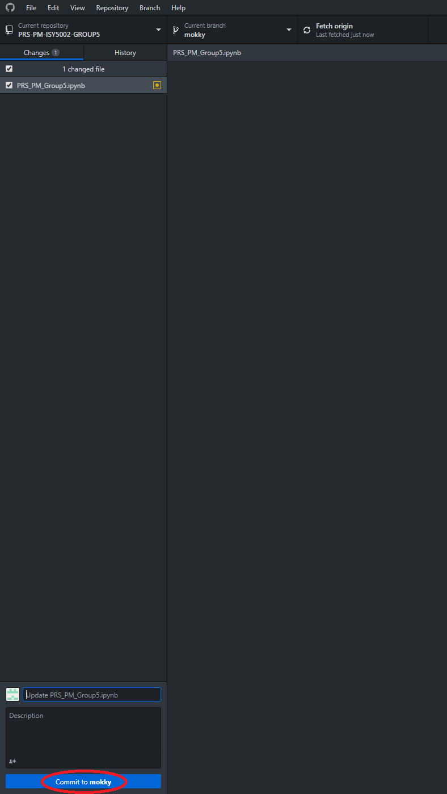

## 1. Run the following commands from the terminal/shell:

```bash
# Setup the git account on the local machine
$ git config --global user.name "kenly.ldk"
$ git config --global user.email "kenly.ldk@gmail.com"
```

```bash
# Preparing the public/private key pair for your git account, the passphrase can be empty for no passphrase
$ ssh-keygen -t rsa -C "kenly.ldk@gmail.com"
> Generating public/private rsa key pair.
Enter file in which to save the key (/Users/kenly/.ssh/id_rsa): ~/.ssh/kenly.ldk@gmail.com
Enter passphrase (empty for no passphrase): 
Enter same passphrase again: 
Your identification has been saved in kenly.ldk@gmail.com.
Your public key has been saved in kenly.ldk@gmail.com.pub.
The key fingerprint is:
SHA256:jDY5s+9XsfvjQWwuvZlZYiJCNVjH3jPPHKT/GZmXUxE kenly.ldk@gmail.com
The key's randomart image is:
+---[RSA 2048]----+
|          ...  E.|
|         o ..  o |
|        . o. .o .|
|       + . .oo+..|
|      B S    o=**|
|     . *    o= B=|
|      . . ..o.* B|
|       . ....+.X.|
|       .o.   oB. |
+----[SHA256]-----+
```

```bash
# Confirm the keypair has been created successfully
$ ls -l ~/.ssh/ | grep kenly.ldk@gmail.com
-rw-------   1 kenly  primarygroup  1876 23 Feb 12:32 kenly.ldk@gmail.com
-rw-r--r--   1 kenly  primarygroup   401 23 Feb 12:32 kenly.ldk@gmail.com.pub
```
 
## 2. Copy the public key to your github account
* Go to the Settings section

<div style="text-align: center"></div>

* Click new SSH key
<div style="text-align: center"></div>

* Copy and paste the content of the .pub key generated in previous step
<div style="text-align: center"></div>

* The key should be saved now
<div style="text-align: center"></div>


## 3. Setup the local and remote repo
```bash
# Add the following section into ~/.ssh/config file and save the file, create the file if it doesn't exist already

Host github.com
    Hostname github.com
    User git
    IdentityFile ~/.ssh/kenly.ldk@gmail.com # This is the private key file that you created earlier
```

```bash
# Clone the git repo to the local machine (Using SSH option)
$ git clone git@github.com:ISS-IS02PT/PRS-PM-ISY5002-GROUP5.git
```

```bash
# A remote repository (pointing to the original github repository) has also been created under the name 'origin'
$ git remote -v
origin  git@github.com:ISS-IS02PT/PRS-PM-ISY5002-GROUP5.git (fetch)
origin  git@github.com:ISS-IS02PT/PRS-PM-ISY5002-GROUP5.git (push)
```

## 4. Using git
- Work on local branch for experiments, random code
- We will be commiting to 'Develop' branch only, when you have a good result, and organized code
- Merging to 'Master' branch will be done via Pull Request

```bash
# Checkout the 'Develop' branch --> only commit directly to 'Develop' branch, and not 'Master' branch
$ git checkout develop
Branch 'develop' set up to track remote branch 'develop' from 'origin'.
Switched to a new branch 'develop'
```

```bash
# You can further create your own branch from 'develop', easier to maintain your own code base. But later on your can commit back to 'develop' branch
$ git checkout -b ken.ldk
Switched to a new branch 'ken.ldk'
```
```bash
# Save the changes to the local git in your branch
$ git add .
```
```bash
# Commit the changes to local branch
$ git commit -m '<<Commit message here>>'

# Backup to centralized git
$ git push origin ken.ldk
```
## You may continue to experiment/refine your code on the local branch. Don't commit back to 'develop' yet.

<hr/>

## UI-based for Desktop
* Click branch dropdown -> "New branch"
<div style="text-align: left"></div>

* Type name of branch into "Name" textbox and click "Create branch"
<div style="text-align: left"></div>

* Select "Bring my changes to \<branch name\>"
* Click "Switch branch"
<div style="text-align: left"></div>

* Select \<branch name\> at the branch dropdown
<div style="text-align: left"></div>
<div style="text-align: left"></div>

* Type commit message title and description
* Click "Commit to \<branch name\>"
<div style="text-align: left"></div>

* Click "Push origin"
<div style="text-align: left"></div>


## 5. Sharing your ready work back to 'develop' branch, when you have organized your code, ready for other to use
```bash
# When you are ready to merge local branch into 'develop' branch.
$ git checkout develop

# No-Fast-forward No-Commit
$ git merge --no-ff --no-commit ken.ldk

# Make a new merged commit from 'develop' branch
$ git commit -m '<<Commit message here>>'
```

```bash
# This is the visualization of what we have just done with merging local branch using the steps above
$ git log --graph --oneline --decorate

*   c792429 (HEAD -> develop) test
|\  
| * 8f1b4db (ken.ldk) test 2
| * c33ba60 test
|/  
* fa0ed32 (origin/develop) Update setup-git/static
* ...
```

```bash
# (Optional) When you are on 'develop' branch
# Delete the local branch, and re-create next time from fresh
$ git branch -d ken.ldk

# If you want to delete + discard changes on local branch
$ git branch -D ken.ldk
```

```bash
# Push this new update back to origin's 'develop' branch, you may be prompted for the password of the ssh private key passphrase if you set it earlier
$ git push origin develop
```
<hr/>

## UI-based for Desktop
* Select "develop" branch from branch dropdown
<div style="text-align: left"></div>

* At top menu bar, click "Branch" -> "Merge into current branch"
<div style="text-align: left"></div>

* At pop up window, select "\<branch name\>" to merge change from
* Click "Merge \<branch name\> into develop"
<div style="text-align: left"></div>

* At top menu bar, click "Branch" -> "Delete"
<div style="text-align: left"></div>

* Click "Push origin" while in "develop" branch
<div style="text-align: left"></div>